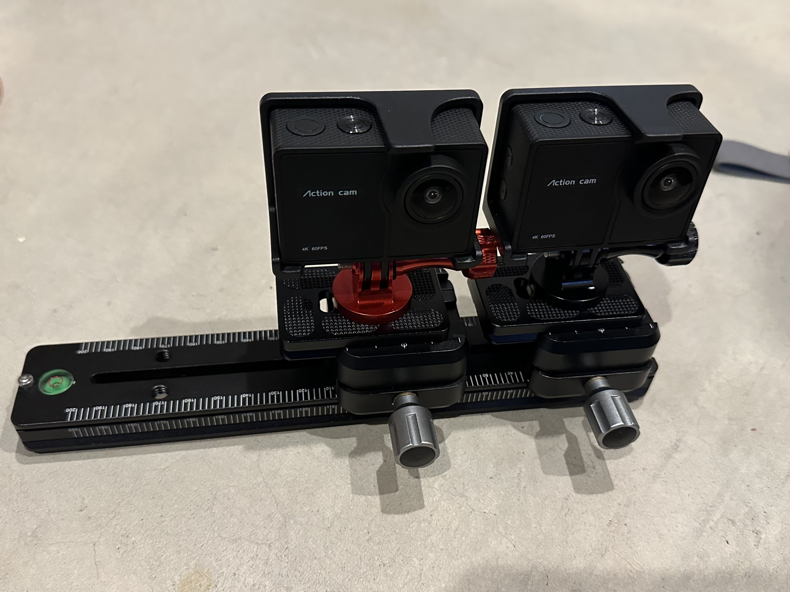
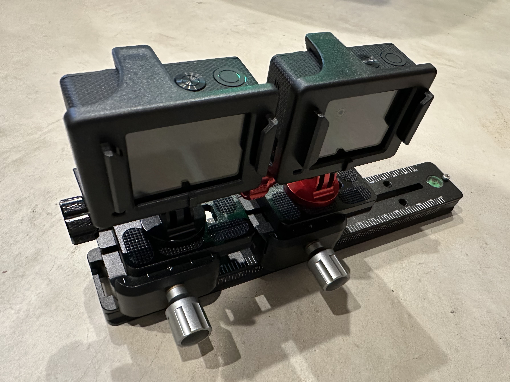

# a16spatial
## A script for generating spatial photos from inexpensive cameras

This script is built to process synchronized photos from two cheap _Action Cameras_ such as the [Timnut aka Onlincam](https://www.amazon.com/dp/B0DD3S6YMM) cameras via a pipeline to correct for lens distortion, alignment errors and then convert to Vision Pro compatible spatial photos. If you search on Amazon, there are many such cameras that are around the same price point and have the same features, the main thing I was looking for was the RF remote that can trigger multiple of the cameras simultaneously.  While sometimes it is not exactly synchronized, it is pretty close most of the time. Cameras such as the GoPro should work as well but they don't come with a remote and cost a lot more.

If you were to use this script with a camera that is much different, say a DSLR, you might want to adjust or comment out the lens correction code, this is just used to compensate for the fisheye distortion of the 170° lens on my cameras.

I used the mount the cameras came with with a quick release Arca Swiss plate mounted to a rail.  The rail is marked and allows me to quickly adjust the distance between the cameras.  Due to their width, they can only get as close as 70mm, but you can slide them further apart as well for hyperstereo shots. But it is best to keep it the same for a session, to make it easier to process the photos later, so you know the baseline to set.

It assumes `ffmpeg`, [`spatialPhotoTool`](https://github.com/zenwheel/spatialPhotoTool), [`StereoAutoAlign`](https://stereo.jpn.org/stereoautoalign/index_mace.html) and [`exiftool`](https://www.exiftool.org) are all in your `$PATH`.  [Homebrew](https://brew.sh) can probably make most of that happen for you.

It prefers metadata from the left eye. The files that are written by the camera are named `IMG<timestamp>-<index>.jpg`, and the script will use the timestamp from the left file and match it to the equivalent index of the right file.  _If for some reason one of the cameras doesn't fire, it is important to hit the shutter on it to keep the indices in sync while shooting._ The EXIF data is copied from the left images to the final images as well.