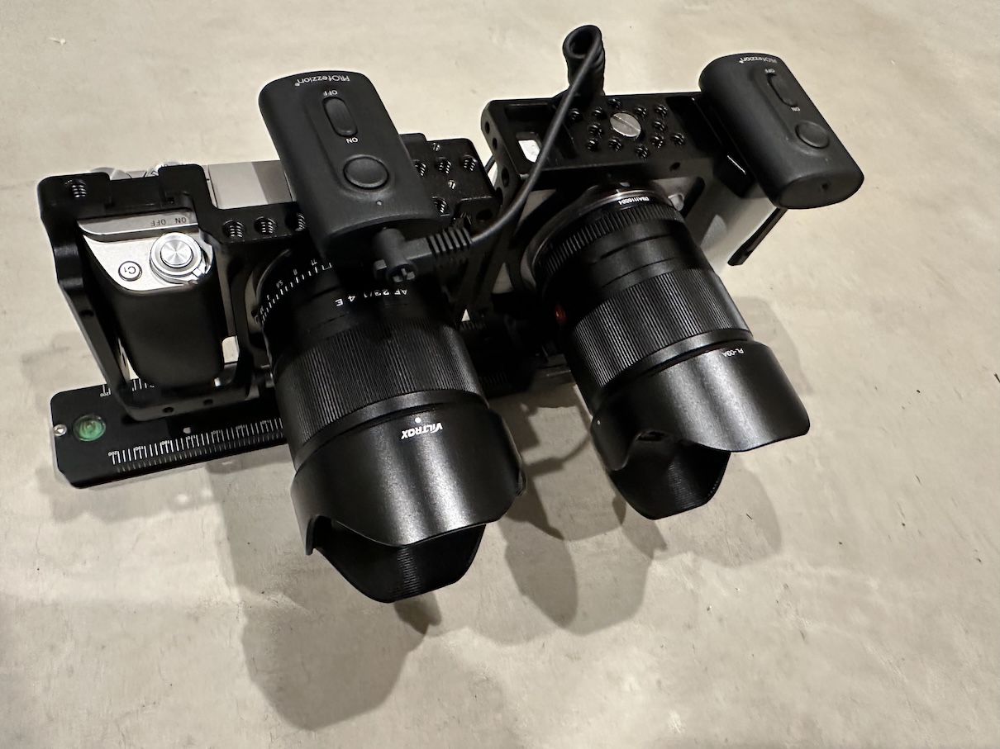
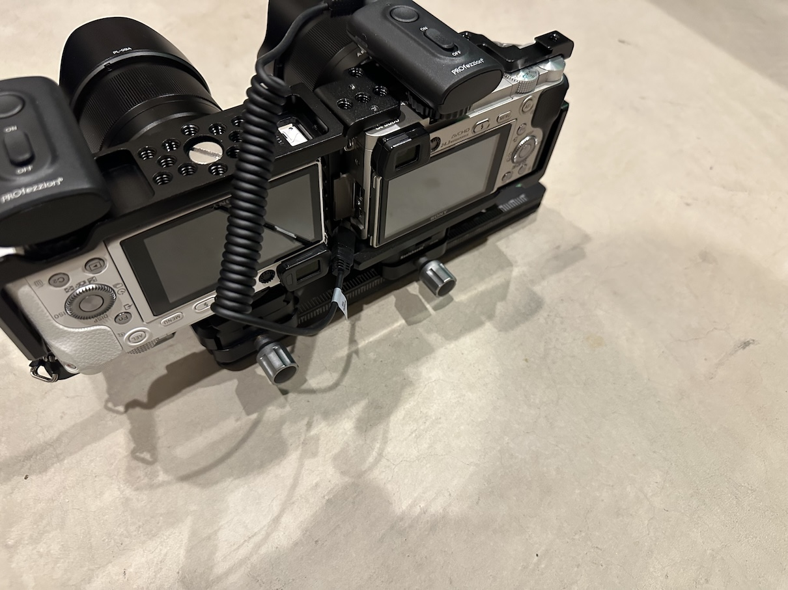

# spatial_scripts
## Scripts for generating spatial photos from various cameras

### a16spatial.py

This script is built to process synchronized photos from two cheap _Action Cameras_ such as the [Timnut aka Onlincam](https://www.amazon.com/dp/B0DD3S6YMM) cameras via a pipeline to correct for lens distortion, alignment errors and then convert to Vision Pro compatible spatial photos. If you search on Amazon, there are many such cameras that are around the same price point and have the same features, the main thing I was looking for was the RF remote that can trigger multiple of the cameras simultaneously.  While sometimes it is not exactly synchronized, it is pretty close most of the time. Cameras such as the GoPro should work as well but they don't come with a remote and cost a lot more.

If you were to use this script with a camera that is much different, say a DSLR, you might want to adjust or comment out the lens correction code, this is just used to compensate for the fisheye distortion of the 170° lens on my cameras.

I used the mount the cameras came with with a quick release Arca Swiss plate mounted to a rail.  The rail is marked and allows me to quickly adjust the distance between the cameras.  Due to their width, they can only get as close as 70mm, but you can slide them further apart as well for hyperstereo shots. But it is best to keep it the same for a session, to make it easier to process the photos later, so you know the baseline to set.

This script prefers metadata from the left eye. The files that are written by the camera are named `IMG<timestamp>-<index>.jpg`, and the script will use the timestamp from the left file and match it to the equivalent index of the right file.  _If for some reason one of the cameras doesn't fire, it is important to hit the shutter on it to keep the indices in sync while shooting._ The EXIF data is copied from the left images to the final images as well.

### slrspatial.py

This is a similar script to the one above, except for not as inexpensive of cameras.  I use it with a pair of Sony α6000 digital SLR Cameras with [SmallRig Camera Cages](https://www.amazon.com/dp/B0185IAYZY) that allow them to be mounted in weird ways, such as upside down or on their sides on a quick release rail like the above rig.  To trigger them, I use a pair of [PROfezzion Wireless Shutter Release Remote Controls](https://www.amazon.com/dp/B09HJDZ5VL) which are RF and allow using multiple receivers on the same channel with the same remote.  With one camera upside down, the lenses can get as close as 105mm, with them mounted on their edges, with the tops together I can get the lenses as close as a baseline of 85mm, which is basically touching with a standard lens.  There's no way to get a 65mm baseline like human vision, but this isn't too bad.

I like to keep the landscape aspect ratio, so putting the cameras on their edge isn't my favorite, so that can be fixed by cropping the images and losing a few pixels (with the `-c option`) or just living with the slightly hyperstereo 105mm baseline.

The script defaults to a 23.5mm sensor width which is the width of the sensor in the Sony α6000 camera.  This value is used for calculating the horizontal field of view.

The script, like the other one, will rename the files from the right camera to match those from the left camera and overwrite their metadata with that of the metadata from the left as well.  The images will go through stereo alignment, and then merged into a spatial photo for Vision Pro.  Since my SLR camera lenses don't have extreme fisheye error like the cheap _Action Cameras_, that step is not required.

### Notes

These scripts assume `ffmpeg`, [`spatialPhotoTool`](https://github.com/zenwheel/spatialPhotoTool), [`StereoAutoAlign`](https://stereo.jpn.org/stereoautoalign/index_mace.html) and [`exiftool`](https://www.exiftool.org) are all in your `$PATH`.  [Homebrew](https://brew.sh) can probably make most of that happen for you.